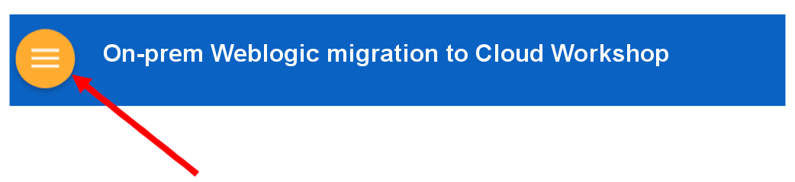

# Continuous Inspection with Sonar Qube

## IMPORTANT: How to prepare for this workshop

**First**, ***Get an Oracle Cloud Account***
- Oracle provides several methods for gaining access to Oracle Cloud Accounts used to complete the Labs in this Hands-on-Workshop.
    - For some workshop events, cloud environments will be provided.
    - For others events (e.g. **Oracle Code**), or when completing this workshop in a self-service model, you must gain access to your own Trial account. Trial accounts can be obtained at [Try It](http://cloud.oracle.com/tryit)
    - If you are attending an Oracle sponsored event, please **review your Event invitation** for more instruction on how to gain access to your Workshop Account.

**Second**, ***Configure your Client Environment***

***Please follow the instruction in the Student Guide*** prior to attempting the Labs.

## How to View the Lab Guides

- The Labguides are best viewed using the Workshop's [GitHub Pages Website URL](https://derekoneil.github.io/cloud-native-devops-workshop/microservices)

- Once you are viewing the Workshop's GitHub Pages website, you can see a list of Lab Guides at any time by clicking on the **Menu Icon**

      

- To log issues and view the Lab Guide source, go to the [github oracle](https://github.com/derekoneil/cloud-native-devops-workshop/tree/master/microservices) repository.

- Visit the [Workshop Interactive Labguide](http://launch.oracle.com/?cloudnative) for a visual overview of the workshop content.

## Continuous Inspection with Sonar Qube

This Oracle Public Cloud DevOps Continuous Inspection with Sonar Qube will walk you through o understand the movement on a Java EE application from their on-prem Weblogic deployment to Oracle's Cloud, during which you will create and deploy Jave EE war files. You will take on 2 Personas during the workshop. The DevOps Manager Persona will add new features and keep the system stable, fast and available. The DevOps Manager will involve integrating development, testing, deployment and release cycle in twitter feed service and alpha product catalog. The Infrastructure person persona will extract Alpha Product Catalog war file and import into the WebLogic Server. During the workshop, you will get exposure to Oracle Developer Cloud Service and Oracle Application Container Cloud Service. Also, you will have option to familiar with Java Cloud Service and AppToCloud tool.

## Workshop Details

**Reference the following Lab Guides by opening their Documentation Files:**

## Lab 050: Trial account setup

**Documenation**: [Lab Guide 050](LabGuide050.md)

### Objectives

## Lab 100: Configure Developer Cloud Service

**Documenation**: [Lab Guide 100](LabGuide100.md)

### Objectives
- Get Started With Developer Cloud Service
  - Create OCI Connection
  - Create project in Developer Cloud Service Instance and configure git
  - Configure Template VM through Developer Cloud Service
  - Design a job and test it by building the application on your Template VM
  
## Lab 200: Deploying SonarQube application to Compute Instance

**Documenation**: [Lab Guide 200](LabGuide200.md)

### Objectives

- Deploying the Application to the Oracle Application Cloud Service Instance
- Verifying the Application Deployment

## Lab 300: Fix issues in code and close issue in Developer Cloud Service

**Documenation**: [Lab Guide 300](LabGuide300.md)

### Objectives

- 

