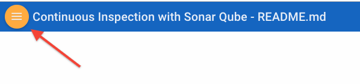

# Continuous Inspection with Sonar Qube

## IMPORTANT: How to prepare for this workshop

**First**, ***Get an Oracle Cloud Account***
- Oracle provides several methods for gaining access to Oracle Cloud Accounts used to complete the Labs in this Hands-on-Workshop.
    - For some workshop events, cloud environments will be provided.
    - For others events (e.g. **Oracle Code**), or when completing this workshop in a self-service model, you must gain access to your own Trial account. Trial accounts can be obtained at [Try It](http://cloud.oracle.com/tryit)
    - If you are attending an Oracle sponsored event, please **review your Event invitation** for more instruction on how to gain access to your Workshop Account.

**Second**, ***Configure your Client Environment***

***Please follow the instruction in the Student Guide*** prior to attempting the Labs.

## How to View the Lab Guides

<!-- - The Labguides are best viewed using the Workshop's [GitHub Pages Website URL](https://derekoneil.github.io/cloud-native-devops-workshop/microservices) -->

- Once you are viewing the Workshop's GitHub Pages website, you can see a list of Lab Guides at any time by clicking on the **Menu Icon**

      

- To log issues and view the Lab Guide source, go to the [github oracle](https://github.com/derekoneil/cloud-native-devops-workshop/tree/master/microservices) repository.

- Visit the [Workshop Interactive Labguide](http://launch.oracle.com/?cloudnative) for a visual overview of the workshop content.

## Continuous Inspection with Sonar Qube

This workshop will walk you through how to manage application lifecycle and do code review using sonarQube. Learn how SonarQube can save time and improve performance by reviewing code and how to to solve those bugs in Agile development.

## Workshop Details

**Reference the following Lab Guides by opening their Documentation Files:**

## Lab 050: Trial account setup

**Documenation**: [Lab Guide 050](LabGuide050.md)

### Objectives

- Get Started With Oracle Cloud Infrastructure
- Create Developer Cloud instance
- Create VCN, compartment and compute instance.

## Lab 100: Configure Developer Cloud Service

**Documenation**: [Lab Guide 100](LabGuide100.md)

### Objectives
- Get Started With Developer Cloud Service
  - Create OCI Connection
  - Create project in Developer Cloud Service Instance and configure git
  - Configure Template VM through Developer Cloud Service
  - Design a job and test it by building the application on your Template VM
  
## Lab 200: Deploying SonarQube application to Compute Instance

**Documenation**: [Lab Guide 200](LabGuide200.md)

### Objectives

- Deploy the SonarQube server to the Compute Instance
- Verify the Server Deployment and run analysis

## Lab 300: Fix issues in code and close issue in Developer Cloud Service

**Documenation**: [Lab Guide 300](LabGuide300.md)

### Objectives

- Run the job to see the new analysis in SonarQube.
- Create issue in Developer Cloud Service
- Fix the issue in code
- Close issue in Developer Cloud Service.

## Lab 400: Deploy microservice to cloud

**Documenation**: [Lab Guide 400](LabGuide400.md)

### Objectives

- Create docker image and push it to Docker Hub.
- Create compute instance using Docker image.
- Test the application.