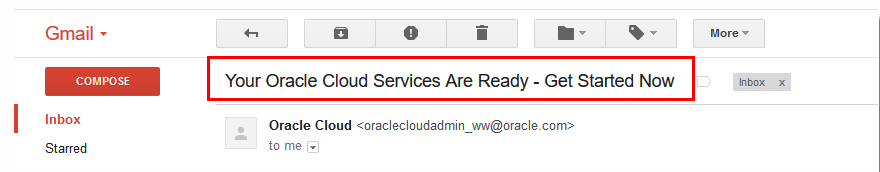
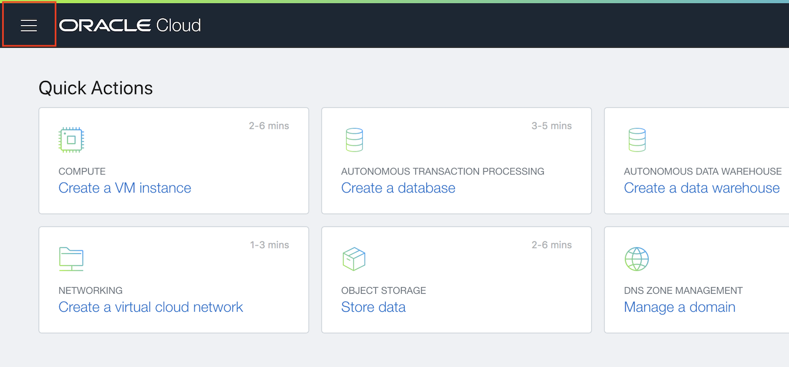
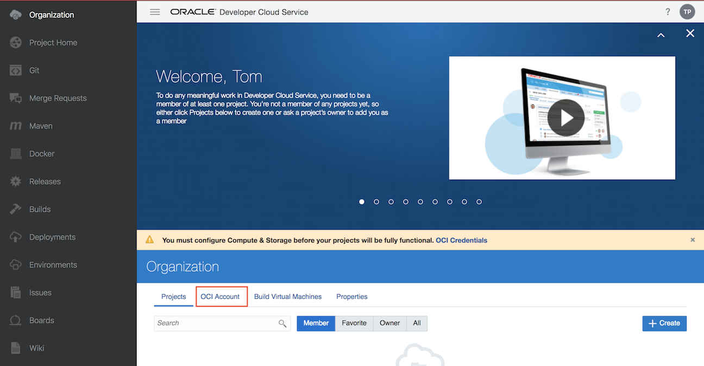
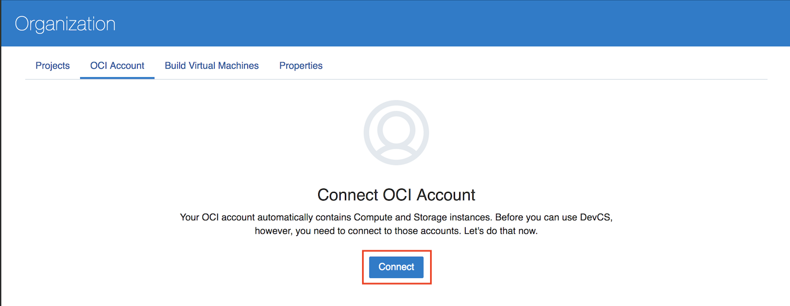
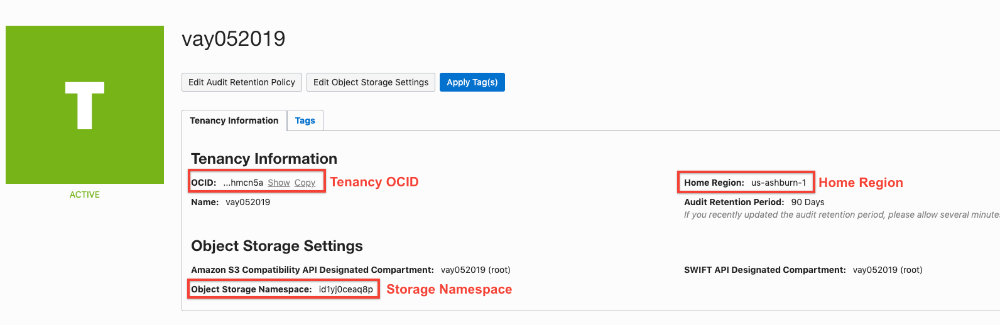
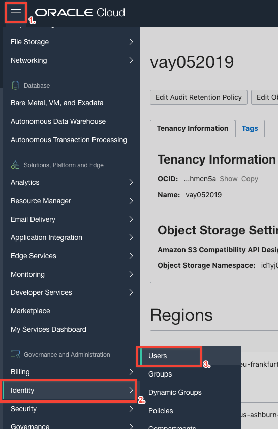
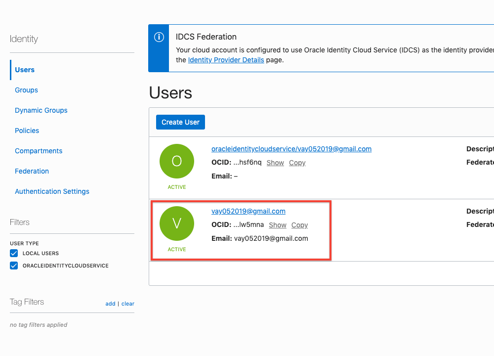
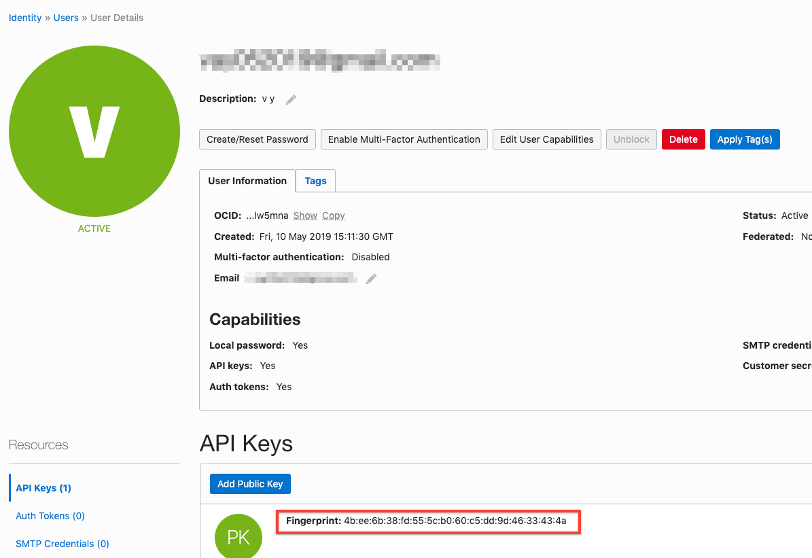
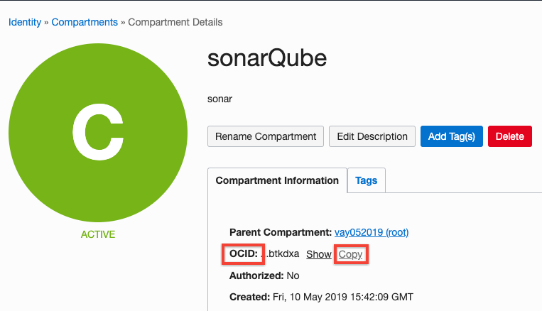

<!--    -->

## Introduction

This is the first of several labs that are part of the **Continous Code Inspection with Sonar Qube.** This workshop will walk you through how to manage application lifecycle and do code review using sonarQube.

**_To log issues_**, click here to go to the [github oracle](https://github.com/oracle/learning-library/issues/new) repository issue submission form.

## Objectives

- Get Started With Oracle Cloud Infrastructure
- Create Developer Cloud instance
- Create VCN, compartment and compute instance.

## Setup trial account

### **STEP 1**: Acquire an Oracle Cloud Trial or Workshop Account

- Bookmark this page for future reference.

- Please click on the following link to create your Free Account, and complete all the required steps to get your free Oracle Cloud Trial Account. When you complete the registration process you'll receive a $300 credit that will enable you to complete the lab for free. Additionally, you'll have 1000s of hours left over to continue to explore the Oracle Cloud.

    - Soon after requesting your trial you will receive the following email. You may begin working on Lab 100 before you receive this email, but you will not be able to start Lab 200 until you have received it.

    

    ***setup a password***

### **STEP 2**: Login to your Oracle Cloud Account
- From any browser, go to the URL:
    `https://cloud.oracle.com`

- click **Sign In** in the upper right hand corner of the browser

    

- Enter your identity domain and click **Next**

    **NOTE:** The **Identity Domain** should come from your Trial confirmation email.

    

- Once your Identity Domain is set, enter your User Name and the Password you set after your confirmation e-mail and click **Sign In**

    

- You will be presented with a Dashboard displaying the various cloud services available to this account.

    

- Click on the hamburger menu on the top left corner and scroll down and click on **My servcies dashboard** which will take you to the service dashboard page.

     

- If all your services are not visible, **click** on the **Customize Dashboard**, you can add services to the dashboard by clicking **Show.** For this workshop, you will want to ensure that you are showing at least the **Java, Application Container, Database and Storage Classic** cloud services. If you do not want to see a specific service, click **Hide**

    

    

### **STEP 3**: Create Developer cloud service instance

- From the OCI Dashboard click the hamburger icon in the top left to expand the services menu.

  

- With the menu open scroll down until you see "My Services Dashboard", once you find it, select it to navigate to your services.

  

- You will see some options to get started with your cloud services. We'll bypass those for now, instead select the hamburger in the top left of the viewport to expand your list of services.

  

- Within the services menu first click "Services" to expand the list. With the full list visible scroll to and select "Developer".

  

- You should see the Developer Cloud Instance you provisioned in the previous lab. Ensure it is in the ready state then click the menu icon to the right of the name and with the options visible select "Access Service Instance".

  

- Now you have landed in the dashboard of your Developer Cloud Service instance. You will notice a warning informing you that you must configure storage to continue with the service. Start the process by clicking "OCI Account" from the horizontal menu below the warning message.

  

- Click "Connect" to begin configuring the connection.

  

- The next steps will require you to pull information from multiple locations within your Oracle Cloud Trial, ensure that you use a separate tab to gather this info while switching back to the below form to insert the information.

  

- First in the OCI console that you started in (the tab should still be open). Expand the same top left hamburger you used to originally access your Service Dashboard. Scroll down to and hover over "Administration" then select "Tenancy Details".

  

- From this page you can find three of the required items you need to complete the OCI Connection: Tenancy OCID, Home-Region, and Storage Namespace. Copy these three items and paste them into the form one at a time.

  

- With all of the tenancy information complete, again expand the hamburger in the top left. This time scroll and hover over "Identity" then select "Users" from the options.

  

- Select the user that does NOT begin with "oracleidentitycloudservice/"; it should be just the email address you use to login to the cloud.

  

- From the user details page copy the User OCID and paste it into the OCI Connection form. Next you will need to create a fingerprint for the user using the keys provided to you in the lab materials. Open the private key in any text editor and copy its contents in entirety into the "Private Key" field on the OCI connection form. Return to the user details page and then select "Add Public Key" from the API keys section.

  

- To obtain the fingerprint you must paste the public key into the provided field. Open the public key and copy its contents the same way you did for the private key. This time paste the key into the field and select "Add".

  

- After clicking add you will see a new fingerprint available, copy the fingerprint you just created and paste it into the OCI Connection form.

  

- Now you will just need to obtain the Compartment OCID from the compartment you created in Lab 50. Expand the top left hamburger once more scroll to and hover over "Identity" and select "Compartments".

  

- Select the compartment you created in Lab 50.

  

- Copy the compartment OCID and then paste it into the corresponding field on the OCI Connection form.

  

- The form should now be completely filled except for passphrase which you will not use in this workshop. Click "Validate" on the bottom of the form and wait to see that compute and storage connections are successful then click "Save".

  

### **STEP 4**: Create Compartment

- Click on the hamburger menu on the top left and then scroll to **identity** and then click **Compartments** .

    

- Click on create compartment

    

- Fill out the details Name, description and then click **Create Compartment**

    

### **STEP 5**: Create VCN and edit security rules

- Once the Compartment is ready, we will create VCN. Click on the hamburger menu on the top left, **Networking** and then click on **Virtual Cloud Networks**

    

- Make sure to select **sonarQube** compartment and then click on **Create Virtual Cloud Network**

    

- Fill out Name and make sure to click on the second option **CREATE VIRTUAL CLOUD NETWORKS PLUS RELATED RESOURCES**
    

- Scroll down and click **Create Virtual Cloud Network**  

    

- Once you see the VCN created click on it and then click on **Security List**

    

- By default one security list is created when you create the VCN, click on it.

    

- Click on **Add Ingress Rules**.
    

- Enter Source CIDR 0.0.0.0/0 and destination port range **9000,8080**. We are opening port 9000 which is default port for running sonarQube which we will deploy in next lab and port 8080 which is default for our web service which we will deploy in lab 400.

    

- Once saved you can see the Ingress Rules as below.

    

### **STEP 6**: Create Instance

- Click on the hamburger menu on top right, then Compute and then click on **Instances**.

    

- Once you see the instances page, make sure to select right compartment and then click on **Create Instance**

    

- Give name of the instance, select availability domain.

    

- Choose the public key provided or paste it.

    

- Click **Create**

    

- Repeat the process and create one more instance named **JavaWebService**.