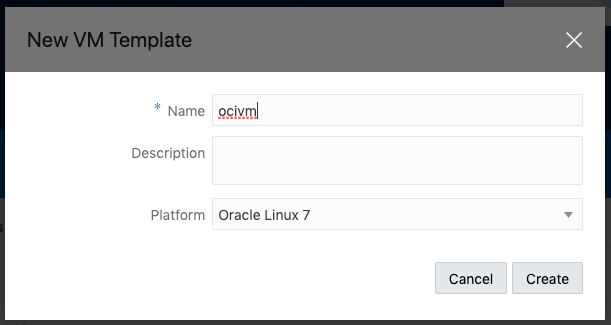
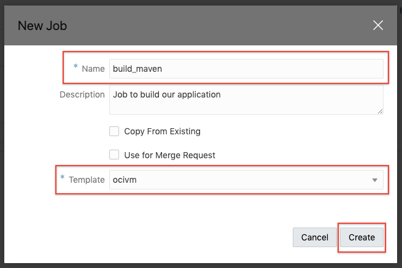
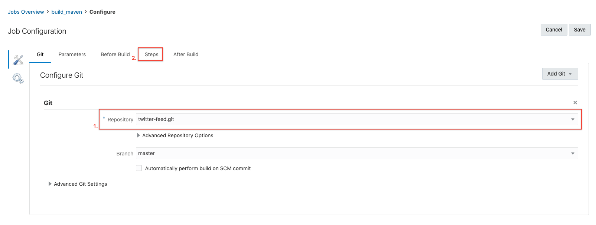
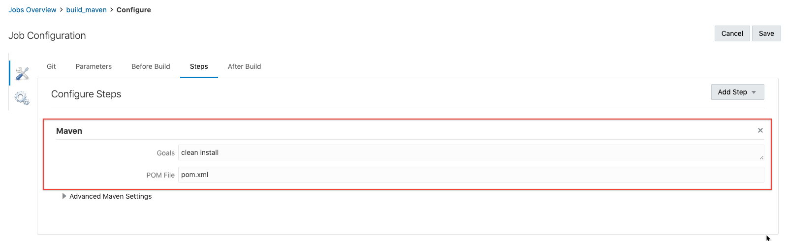

## Introduction

This is the first of several labs that are part of the **Continous Code Inspection with Sonar Qube.** This workshop will walk you through how to manage application lifecycle and do code review using sonarQube.

**_To log issues_**, click here to go to the [github oracle](https://github.com/oracle/learning-library/issues/new) repository issue submission form.

## Objectives

- Get Started With Developer Cloud Service
  - Create OCI Connection
  - Create project in Developer Cloud Service Instance and configure git
  - Configure Template VM through Developer Cloud Service
  - Design a job and test it by building the application on your Template VM

## Required Artifacts

For this lab you will need Github and Oracle Cloud account Hub Accounts. Use the following links to set up:

## Run a build job in Developer Cloud Service

### **STEP 1**: Create VM Template for Job Execution

- First though you must create a Virtual Machine template. From the same Nav-bar you selected "OCI Connection", select "Virtual Machine Templates".

  

- Select "Create".

  

- Give the template a name, the guide follows the name **Build VM**. Add a brief description and leave the platform as the default value.

  

### **STEP 2**: Create Developer Cloud Project and Configure Git

- Now that you have several of the tools within Developer Cloud Service setup to handle a project, you can create a project within the service. From the nav-bar select "Projects". Select "Create".

  

- Give the project name **SonarQube_demo** and add a brief description; the remaining values can be left in their default settings. Select "Next".

  

- Select "Empty Project" and click "Next".

  

- You can leave the Wiki Markup field set to Markdown. Select "Finish".

  

- You will see a loading screen showing you all of the services being built into your project for you by Developer Cloud Service. This should take 1 to 2 minutes to complete.

  

- You will land in the "Project Home" of your new project. Select the hamburger icon in the top left and then select "Git" from the list of options.

  

- Select "Create Repository".

  

- Give your new repo a name, brief description and select "Import existing repository". In the textbox that appears paste this link https://github.com/varunyn/twitter-feed-sonarQube.git , then select "Create".

  

### **STEP 3**: Configure and Run Successful Build Job

- You will now see the file structure imported from github on your page, its time to build using your VM template. If the side menu is not open, once more select the hamburger from the top left and select "Builds".

  

- Select the blue button labeled "Create Job".

  

- Give the job a descriptive name and a brief description. Then select the template you created earlier from the dropdown. With everything filled out, select "Create".

  

- You will be taken to the Job Configuration page for your new job. The first thing you need to is connect the git repo you just established to the job. Select "Add Git" to see the options then select "Git".

  

- Using the repository dropdown select your git repository. Leave everything else as default. Then from the Nav-bar above select "Steps".

  

- Select "Add Step" and from the dropdown select "Maven".

  

- Goals should read **clean install** and POM File should read **pom.xml**. Then in the upper right select save.

  

- You will be taken to the home page for the job. Select "Build Now", this will provision a VM spec'd to your template, using your OCI connection to build the app you have imported from github. While you see "Waiting for executor" the OCI instance is being provisioned, once you see a progress bar then Developer Cloud Service is running the steps you established in your job inside the OCI instance. When complete you should see a check mark next to the job.

  
