 Updated: 07/24/2018

## Introduction

This lab focus on moving the on-premise WebLogic Server app to Java Cloud Service. Java Cloud Service is ideal for development, testing, user acceptance testing, staging and production. Also, it allows to instantly create dedicated and isolated WebLogic Server environments (11g or 12c version) to run your entire cluster at scale.

## Objectives

- Get Started With Developer Cloud Service
  - Create OCI Connection
  - Create project in Developer Cloud Service Instance and configure git
  - Configure Template VM through Developer Cloud Service
  - Design a job and test it by building the application on your Template VM

## Required Artifacts

For this lab you will need Github and Oracle Cloud account Hub Accounts. Use the following links to set up:

## Deploying the Application to the Oracle Java Cloud Service

### **STEP 1**: Access Developer Cloud Service and Create OCI Connection

  - From the OCI Dashboard click the hamburger icon in the top left to expand the services menu.

  

  - With the menu open scroll down until you see "My Services Dashboard", once you find it, select it to navigate to your services.

  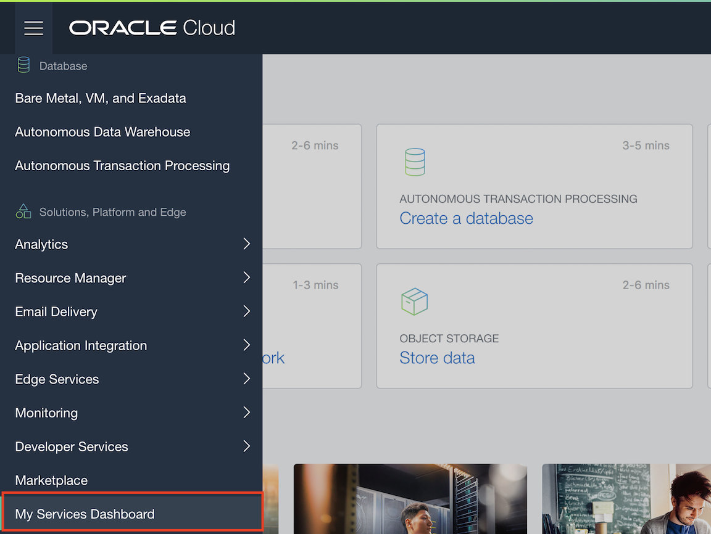

  - You will see some options to get started with your cloud services. We'll bypass those for now, instead select the hamburger in the top left of the viewport to expand your list of services.

  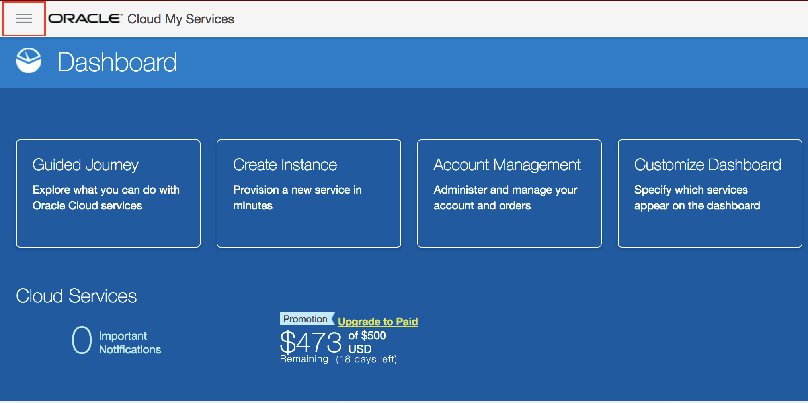

  - Within the services menu first click "Services" to expand the list. With the full list visible scroll to and select "Developer".

  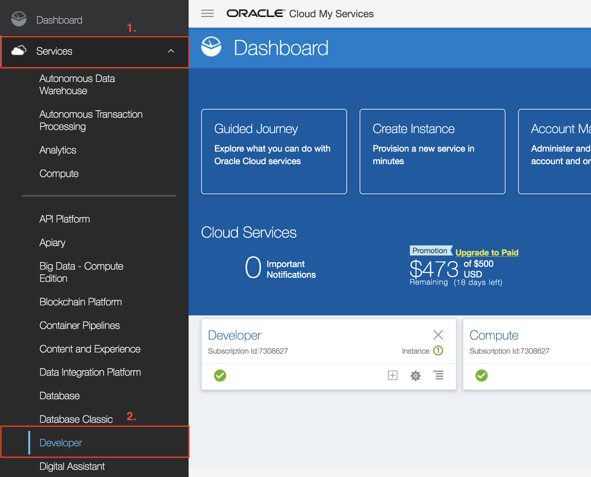

  - You should see the Developer Cloud Instance you provisioned in the previous lab. Ensure it is in the ready state then click the menu icon to the right of the name and with the options visible select "Access Service Instance".

  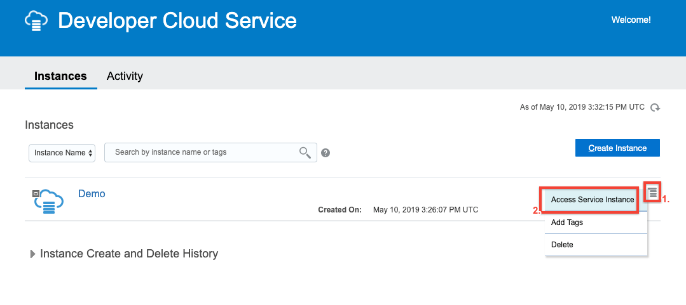

  - Now you have landed in the dashboard of your Developer Cloud Service instance. You will notice a warning informing you that you must configure storage to continue with the service. Start the process by clicking "OCI Account" from the horizontal menu below the warning message.

  

  - Click "Connect" to begin configuring the connection.

  

  - The next steps will require you to pull information from multiple locations within your Oracle Cloud Trial, ensure that you use a separate tab to gather this info while switching back to the below form to insert the information.

  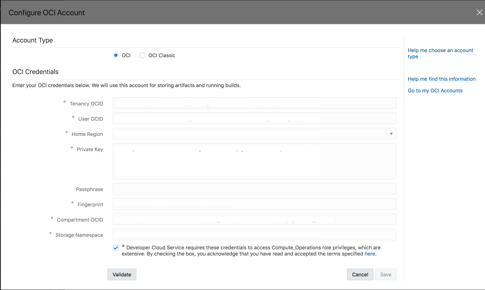

  - First in the OCI console that you started in (the tab should still be open). Expand the same top left hamburger you used to originally access your Service Dashboard. Scroll down to and hover over "Administration" then select "Tenancy Details".

  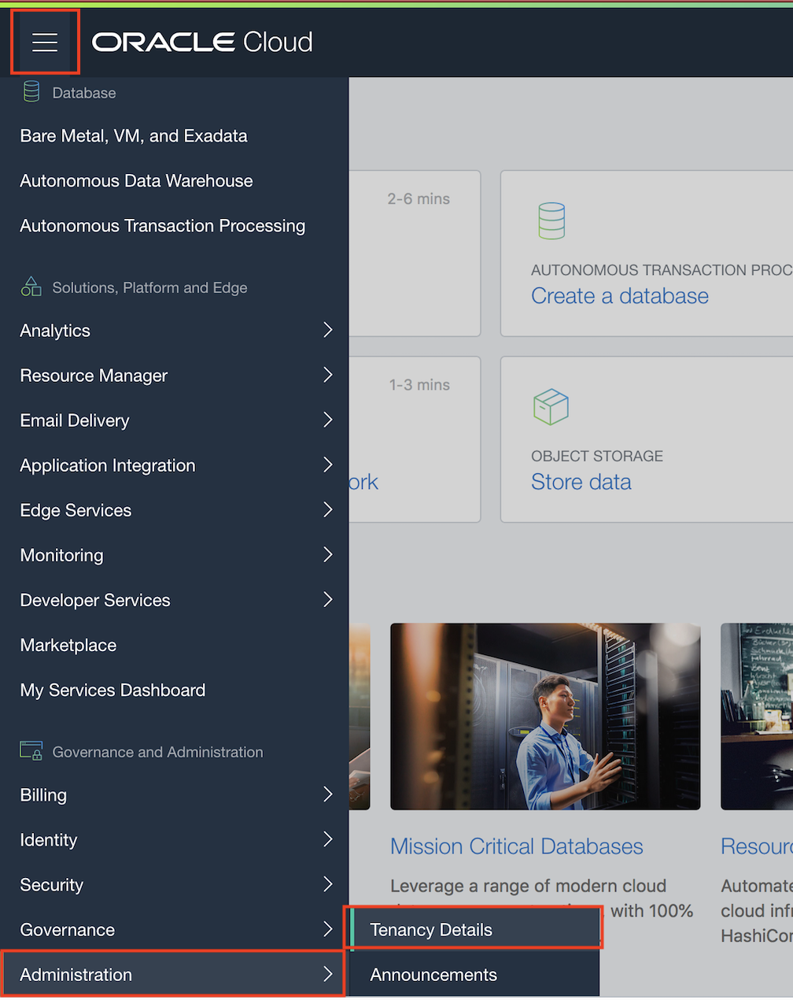

  - From this page you can find three of the required items you need to complete the OCI Connection: Tenancy OCID, Home-Region, and Storage Namespace. Copy these three items and paste them into the form one at a time.

  

  - With all of the tenancy information complete, again expand the hamburger in the top left. This time scroll and hover over "Identity" then select "Users" from the options.

  

  - Select the user that does NOT begin with "oracleidentitycloudservice/"; it should be just the email address you use to login to the cloud.

  

  - From the user details page copy the User OCID and paste it into the OCI Connection form. Next you will need to create a fingerprint for the user using the keys provided to you in the lab materials. Open the private key in any text editor and copy its contents in entirety into the "Private Key" field on the OCI connection form. Return to the user details page and then select "Add Public Key" from the API keys section.

  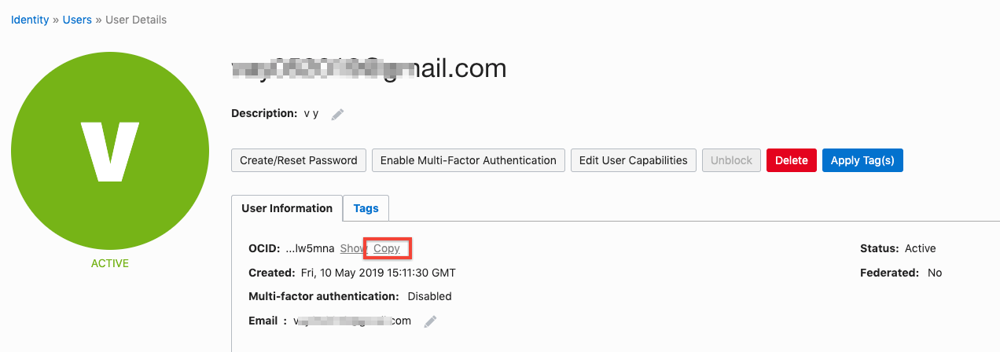

  - To obtain the fingerprint you must paste the public key into the provided field. Open the public key and copy its contents the same way you did for the private key. This time paste the key into the field and select "Add".

  

  - After clicking add you will see a new fingerprint available, copy the fingerprint you just created and paste it into the OCI Connection form.

  

  - Now you will just need to obtain the Compartment OCID from the compartment you created in Lab 50. Expand the top left hamburger once more scroll to and hover over "Identity" and select "Compartments".

  

  - Select the compartment you created in Lab 50.

  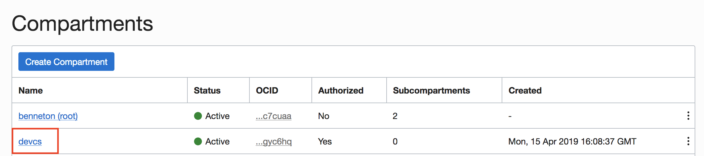

  - Copy the compartment OCID and then paste it into the corresponding field on the OCI Connection form.

  

  - The form should now be completely filled except for passphrase which you will not use in this workshop. Click "Validate" on the bottom of the form and wait to see that compute and storage connections are successful then click "Save".

  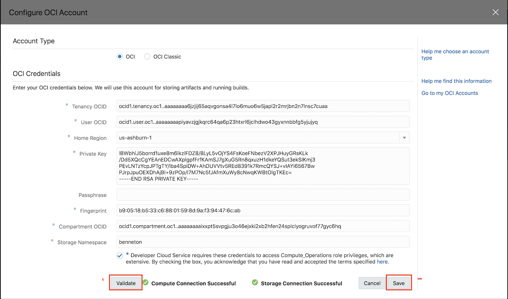

### **STEP 2**: Create VM Template for Job Execution

  - With your OCI Connection established you can now create VM's to test code within your Developer Cloud Service projects. First though you must create a Virtual Machine template. From the same Nav-bar you selected "OCI Connection", select "Virtual Machine Templates".

  

  - Select "Create".

  

  - Give the template a name, the guide follows the name **Build VM**. Add a brief description and leave the platform as the default value.

  

### **STEP 3**: Create Developer Cloud Project and Configure Git

  - Now that you have several of the tools within Developer Cloud Service setup to handle a project, you can create a project within the service. From the nav-bar select "Projects". Select "Create".

  

  - Give the project name **SonarQube_demo** and add a brief description; the remaining values can be left in their default settings. Select "Next".

  

  - Select "Empty Project" and click "Next".

  

  - You can leave the Wiki Markup field set to Markdown. Select "Finish".

  

  - You will see a loading screen showing you all of the services being built into your project for you by Developer Cloud Service. This should take 1 to 2 minutes to complete.

  

  - You will land in the "Project Home" of your new project. Select the hamburger icon in the top left and then select "Git" from the list of options.

  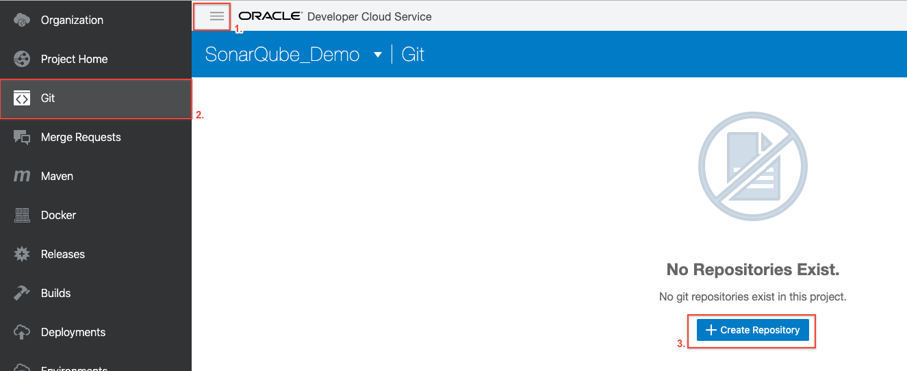

  - Select "Create Repository".

  

  - Give your new repo a name, brief description and select "Import existing repository". In the textbox that appears paste this link (GITHUB LINK HERE), then select "Create".

  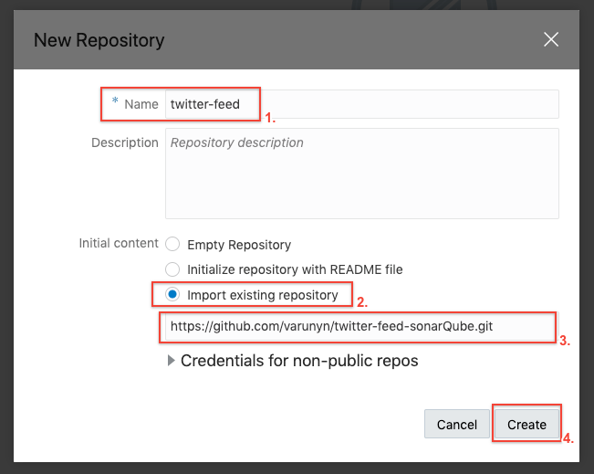

### **STEP 4**: Configure and Run Successful Build Job

  - You will now see the file structure imported from github on your page, its time to build using your VM template. If the side menu is not open, once more select the hamburger from the top left and select "Builds".

  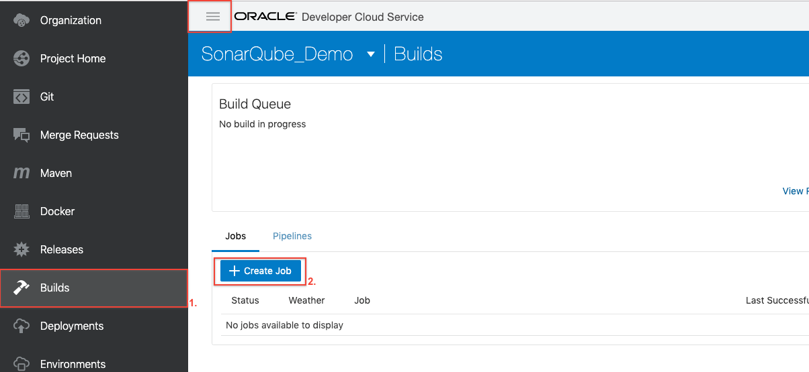

  - Select the blue button labeled "Create Job".

  

  - Give the job a descriptive name and a brief description. Then select the template you created earlier from the dropdown. With everything filled out, select "Create".

  

  - You will be taken to the Job Configuration page for your new job. The first thing you need to is connect the git repo you just established to the job. Select "Add Git" to see the options then select "Git".

  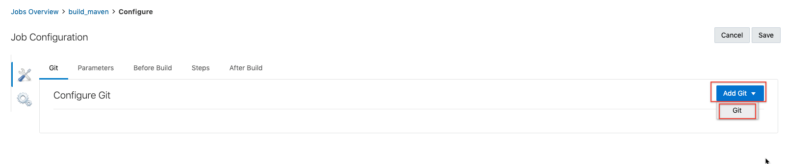

  - Using the repository dropdown select your git repository. Leave everything else as default. Then from the Nav-bar above select "Steps".

  

  - Select "Add Step" and from the dropdown select "Maven".

  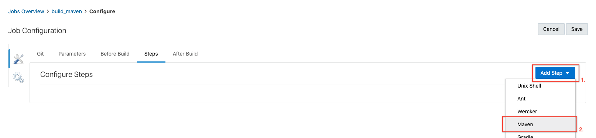

  - Goals should read **clean install** and POM File should read **pom.xml**. Then in the upper right select save.

  

  - You will be taken to the home page for the job. Select "Build Now", this will provision a VM spec'd to your template, using your OCI connection to build the app you have imported from github. While you see "Waiting for executor" the OCI instance is being provisioned, once you see a progress bar then Developer Cloud Service is running the steps you established in your job inside the OCI instance. When complete you should see a check mark next to the job.

  
