## Introduction

This is the first of several labs that are part of the **Continous Code Inspection with Sonar Qube.** This workshop will walk you through how to manage application lifecycle and do code review using sonarQube.

## Objectives

- Fix the issue in code
- Run the job to see the new analysis
- Close issue.

## Required Artifacts

For this lab you will need Oracle Cloud account and Developer Cloud service instance.

## Fixing the issue in code

### **STEP 1**: Check for the issue in SonarQube

- Continuing the previous lab, go to the issues page in sonarQube, for this workshop we will solve the issue type Bug.

    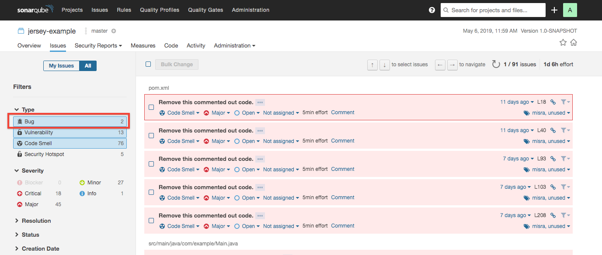

- As you can see there are two issues shown under bug category with severity Critical and Major. 

    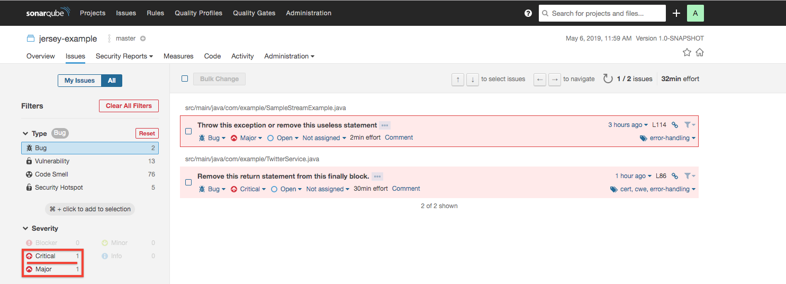

- Click on the first issue and check for the error message. As you see the error message, you can select the type of issue, severity, whether the issue is solved or still open, who is it assign to and how many minutes it might take to fix the issue.

    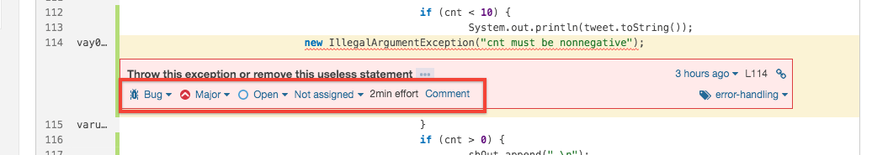

### **STEP 2**: Create issue in Developer Cloud Service

- We will generate new issue based on the error messagee seen in the previous step. Click on **Issues** in the left panel and then click on **Create Issue**.

    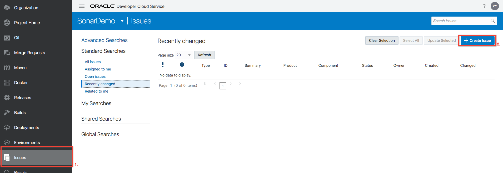

- Fill out the form as shown in the below image.

    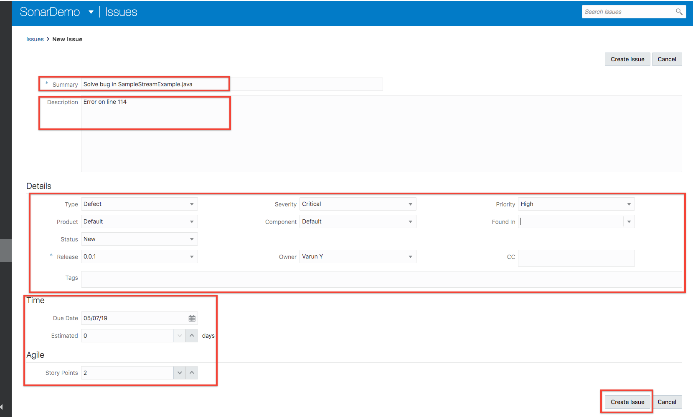

- Repeat the process and create another issue.

### **STEP 3**: Edit code in DevCS git repo

- Click on **Git** in left panel to see the code repository.

    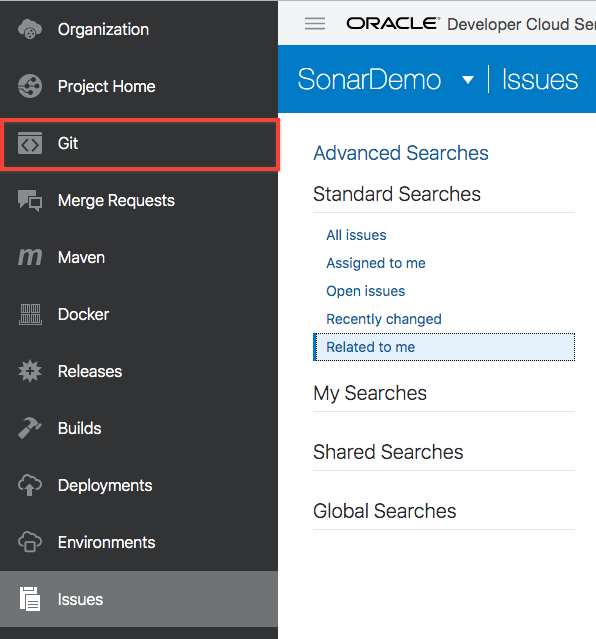

- Go to the file SampleStreamExample.java , path as shown in following image and  click on pencil icon to edit.
    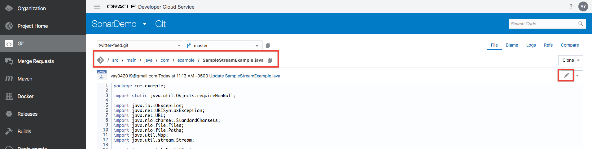

- Go to line 114 and add word **throw** before the line.

    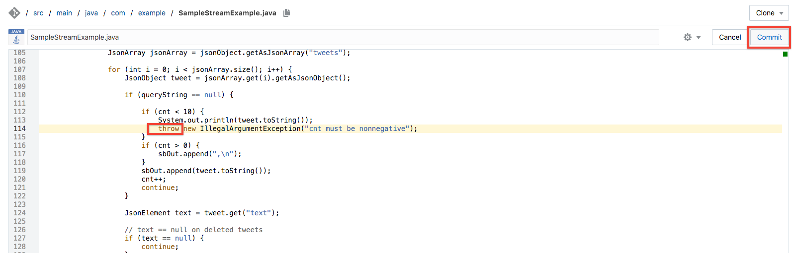

- Repeat the process and go to file TwitterService.java, path as shown in following image and click on pencial icon to edit.

    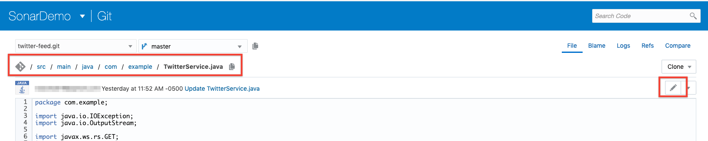

- Go to line 86 and remove **return**. 
Reason of error: Using return, break, throw, and so on from a finally block suppresses the propagation of any unhandled Throwable which was thrown in the try or catch block.
    
    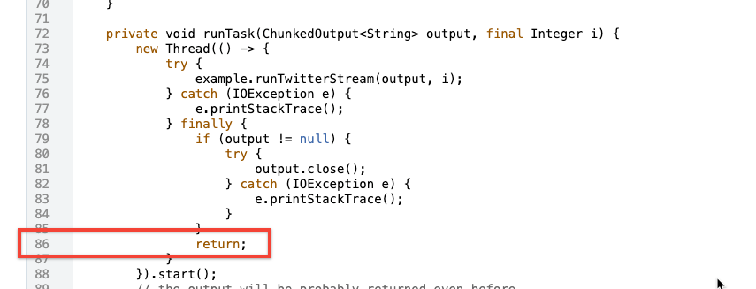

### **STEP 4**: Check the SonarQube for issue fix

- With the job already configured to run automatically on commit, go to SonarQube server dashboard. And you can see there are zero bugs shown.

    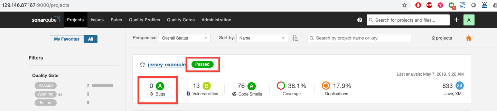

- To confirm open issues page and click on bug.

    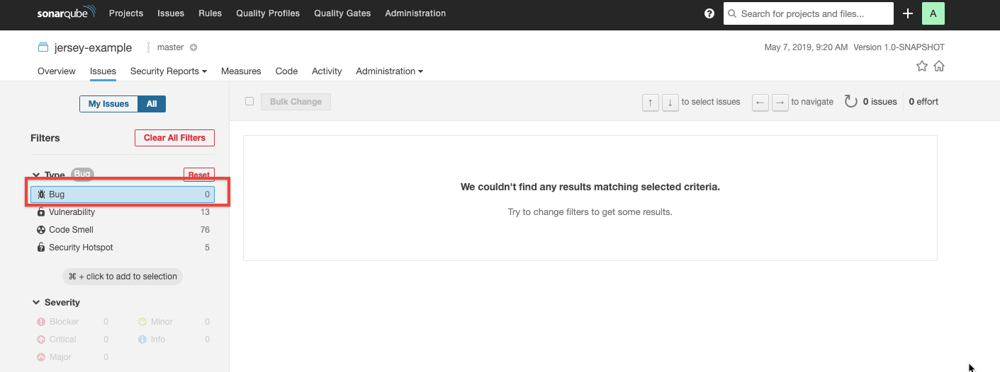
   
### **STEP 5**: Close the issue in Developer Cloud Service

- Go back to Developer cloud service and click on **Issues** in left panel.

    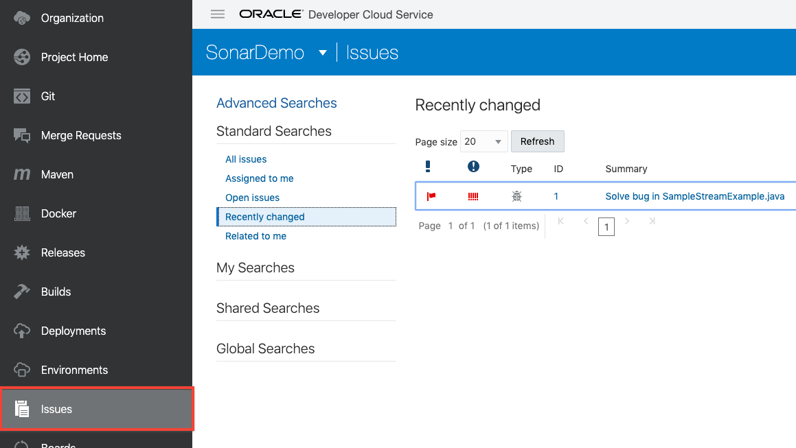

- Select the issue and then click on **Update Selected**

    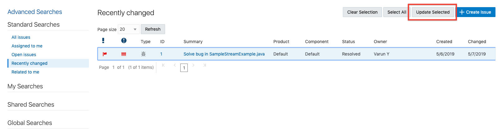
    
- In the form check the Status and select Resolved . Also check Resolution and select Fixed from dropdown, click **Next** when finished and then Save to close the issue.
    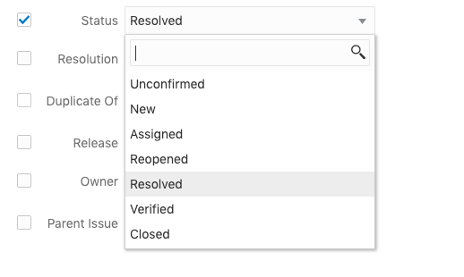
    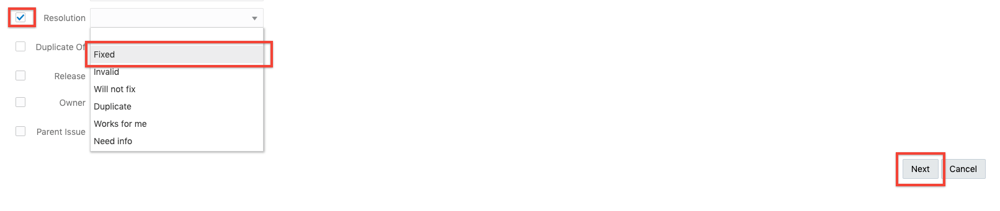

