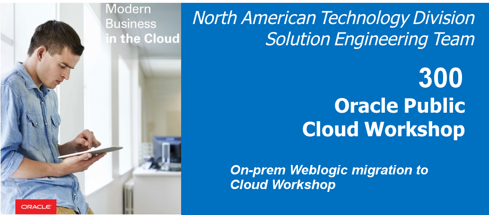

  
Updated: 07/24/2018

## Introduction

This lab focus on moving the on-premise WebLogic Server app to Java Cloud Service. Java Cloud Service is ideal for development, testing, user acceptance testing, staging and production. Also, it allows to instantly create dedicated and isolated WebLogic Server environments (11g or 12c version) to run your entire cluster at scale.

## Objectives

- Move on premise WebLogic Server to Oracle Java Cloud Service.
  - Create database instance
  - Create Java Cloud Service instance
  - Move application to Java Cloud Service

## Required Artifacts

For this lab you will need Github and Oracle Cloud account Hub Accounts. Use the following links to set up:

# On premise WebLogic Server to Java Cloud Service

## Deploying the Application to the Oracle Java Cloud Service

### **STEP 1**: Create Database Instance in Cloud

