## Introduction

This is the first of several labs that are part of the **Continous Code Inspection with Sonar Qube.** This workshop will walk you through how to manage application lifecycle and do code review using sonarQube.

**_To log issues_**, click here to go to the [github oracle](https://github.com/oracle/learning-library/issues/new) repository issue submission form.

## Objectives

- Create docker image and push it to Docker Hub.
- Create compute instance using Docker image.
- Test the application.

## Required Artifacts

For this lab you will need Github and Oracle Cloud account Hub Accounts. Use the following links to set up:

## Deploying the Application to Compute Instance 

### **STEP 1**: Create Build Job to create and push Docker image to registry

-  Create Build Job. Click on **Builds** in left menu and then click **Create Job**.

    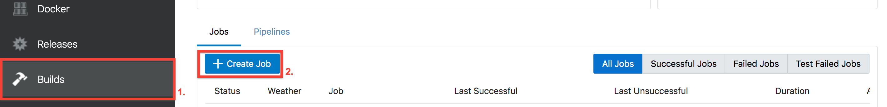

- Give name to job and select template.

    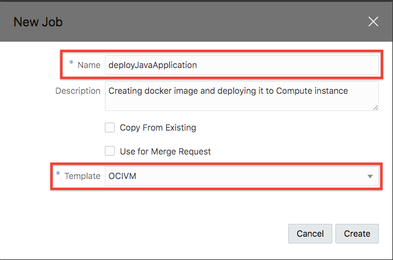

- Click on git, add Git and then make sure to select correct git repository.

    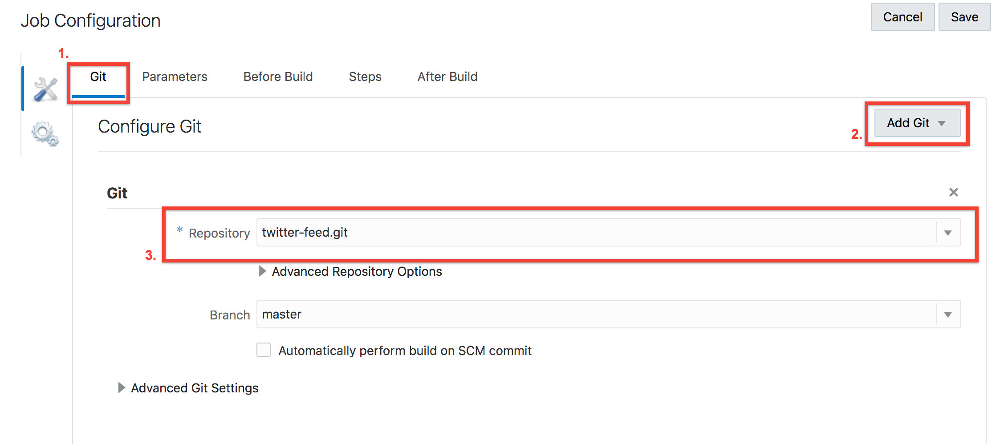

- Click on **Steps** , **Add step** , select Docker and then **Docker login**.

    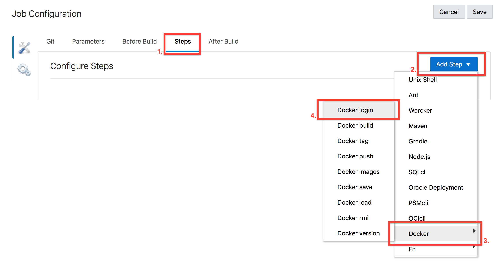

- Enter username and password for the docker hub account.

    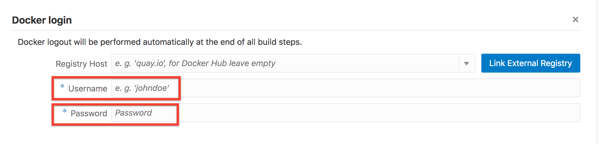

- Again click on **Steps** , **Add step** , select Docker and then **Docker build**.

    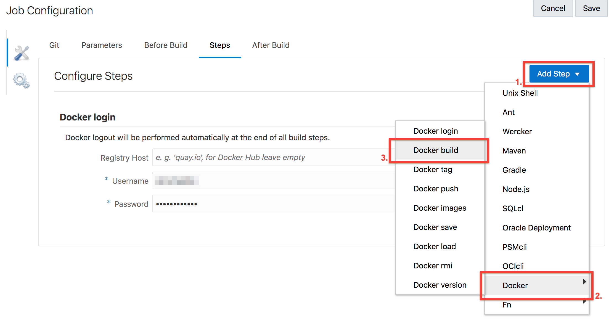

- Enter Registry host, desired name for the image (twitter-feed), tag (latest) and source (we have it in git repo)

    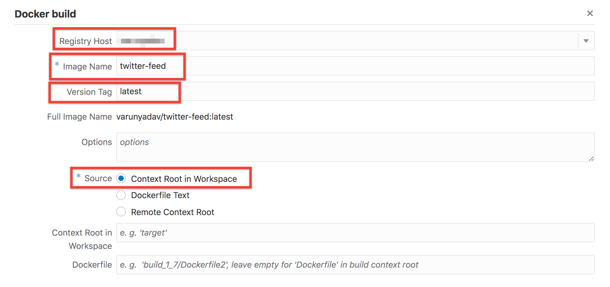

- Once again click on **Steps** , **Add step** , select Docker and then **Docker push**.

    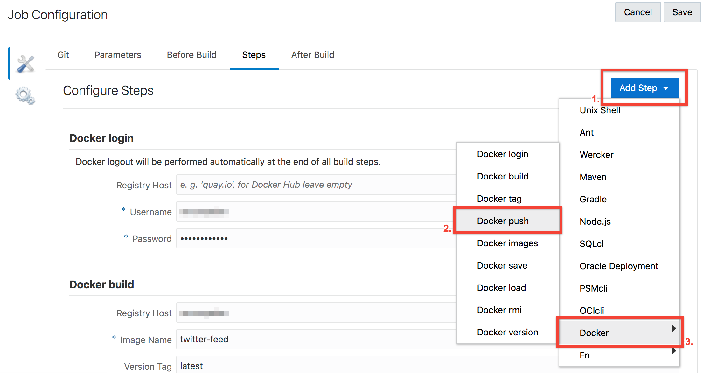

- Enter registry host and name of the image and then click Save on top of the page.

    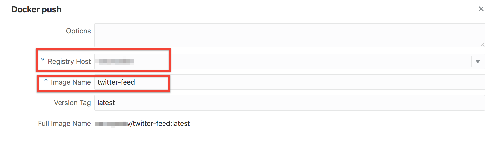

- Run the job and see the build logs to see if it is successful. To confirm go to Docker hub and click on repositories in menu.

    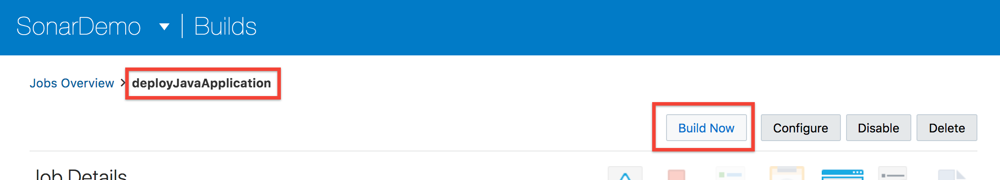
    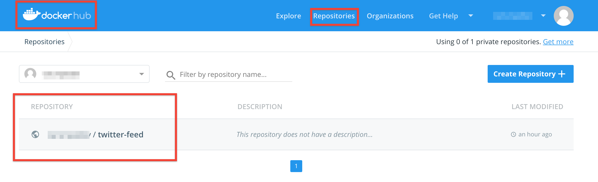

### **STEP 2**: Create Build Job to run Docker image in Compute Instance

- Create Build Job. Click on **Builds** in left menu and then click **Create Job**.

    

- Give name to job and select template.

    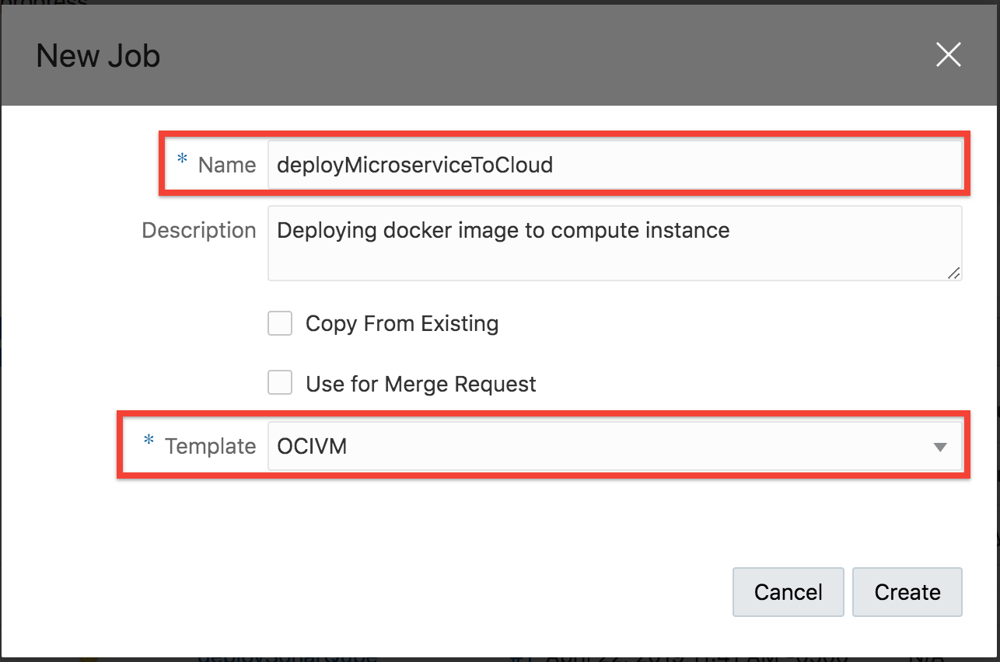

- Click on **Before Build**, **Add Before Build Action** and then select **SSH configuration**.

    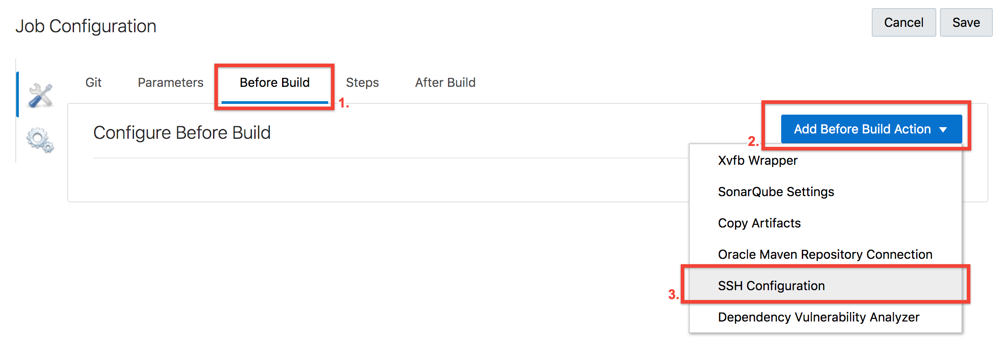

- Paste the private key provided in git repo and select option Setup files in ~/.ssh for command line tools
    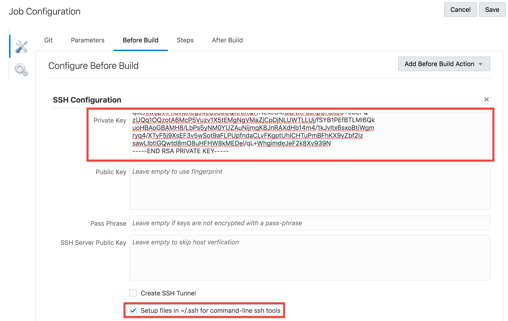

- Click on **Steps**, **Add Step** and select **Unix Shell**. 
    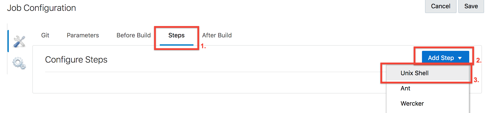

- Paste the below command to the shell

```
ssh -o StrictHostKeyChecking=no opc@ENTER_THE_IP_ADDRESS_HERE << EOF
sudo yum install -y yum-utils \
  device-mapper-persistent-data \
  lvm2
sudo yum-config-manager \
    --add-repo \
    https://download.docker.com/linux/centos/docker-ce.repo
sudo yum -y install docker-ce docker-ce-cli containerd.io
sudo systemctl start docker
sudo docker pull DOCKER_IMAGE_NAME
sudo firewall-cmd --zone=public --permanent --add-port=8080/tcp
sudo firewall-cmd --reload
sudo docker run --detach -p 8080:8080 DOCKER_IMAGE_NAME
exit
EOF
```

NOTE: Replace the IP address with the IP address of your compute image, docker image name from your docker hub.

    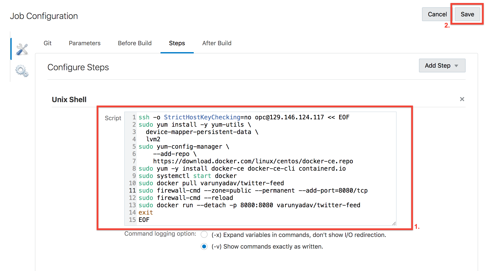

- Build the job. Check the logs.

    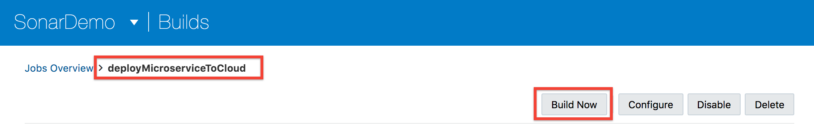

- To confirm everything is deployed successfully. Go to your IP_address:8080/statictweets

    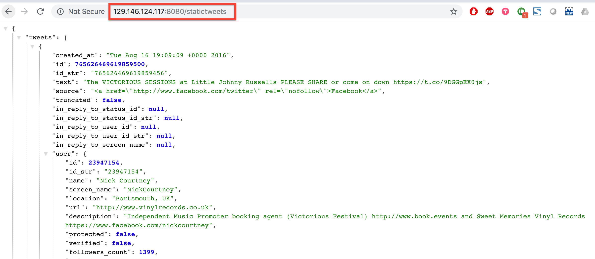
