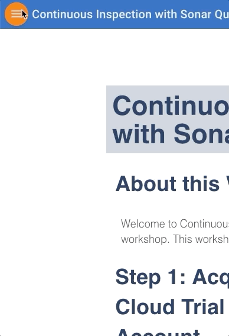

# Continuous Inspection with Sonar Qube

## About this Workshop
 
 Welcome to Continuous Inspection with Sonar Qube workshop. This workshop will walk you through how to manage application lifecycle and do code review using sonarQube. Learn how SonarQube can save time and improve performance by reviewing code and how to to solve those bugs in Agile development

## Step 1: Acquire an Oracle Cloud Trial or Workshop Account

- Bookmark this page for future reference.

- Please click on the following link to create your Free Account, and complete all the required steps to get your free Oracle Cloud Trial Account. When you complete the registration process you'll receive a $300 credit that will enable you to complete the lab for free. Additionally, you'll have 1000s of hours left over to continue to explore the Oracle Cloud.

    

- Soon after requesting your trial you will receive the following email.

## Step 2: Navigate to Lab 050

- You can see a list of Lab Guides by clicking on the Menu Icon in the upper left corner of the browser window.

    

You're now ready to continue with [Lab Guide 050](LabGuide050.md)